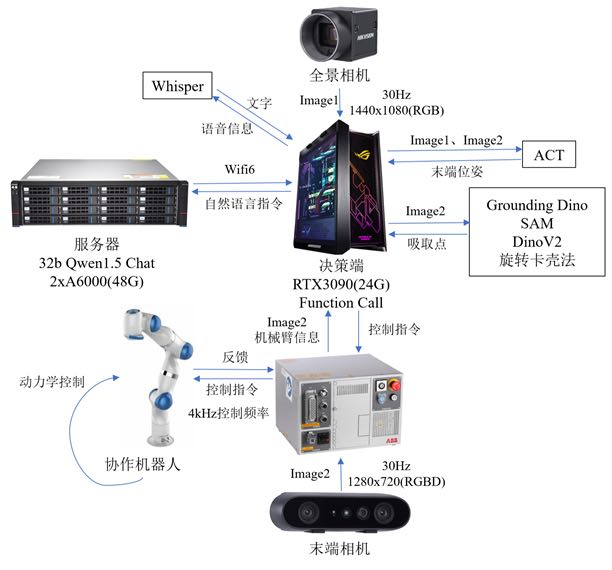
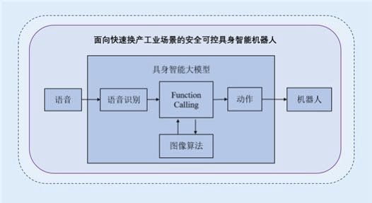

## Introduction

In the design and implementation of an automatic loading and unloading  system for the field of industrial automation, we have developed an  autonomous and controllable embodied intelligent robot system aimed at  enhancing the robustness and versatility of industrial automation  systems for rapid changeover industrial scenarios. In the simulated  rapid changeover industrial production environment we have constructed,  we have built a basic functional framework for the intelligent agent  system based on the "[Qwen1.5](https://github.com/QwenLM/Qwen)" large language model.



## 

## Dependencies

- python 3.9
- cuda 11.8
- pytorch 2.0.0

## Installation

### 1. (Optional) Creating conda environment

```bash
conda create -n cncb python=3.9
conda activate cncb
```

### 2. Git clone

```bash
git clone https://github.com/AGI-Outfit/CNCB
```

### 3. Install from .txt with pip

```bash
pip install -r requirements.txt
```

## Usage

```bash
python test.py
```

